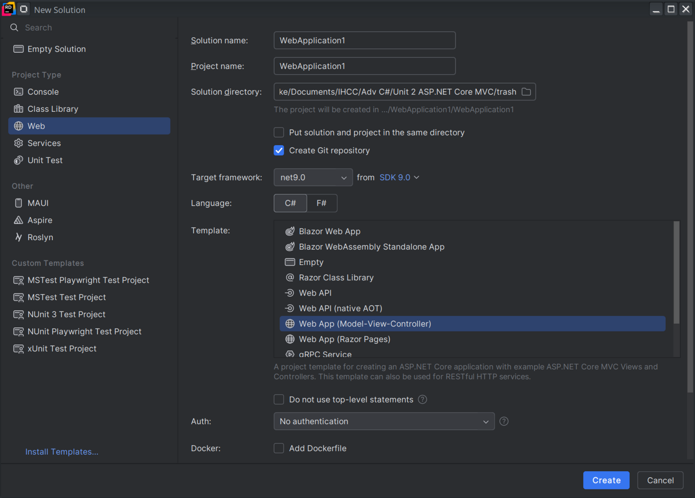
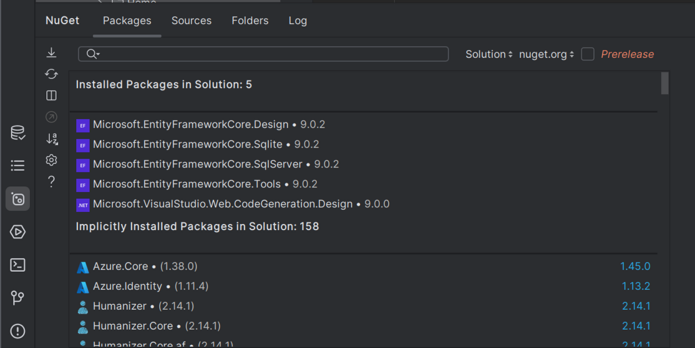
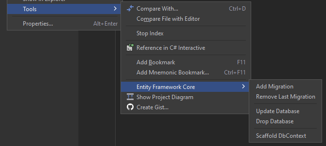

# Unit 1 Ship Creator

Using [this tutorial](https://learn.microsoft.com/en-us/aspnet/core/tutorials/first-mvc-app/start-mvc?view=aspnetcore-9.0&tabs=visual-studio) as a guide build a Model-View-Controller in ASP.NET Core. Make sure the **project is in the root** of the repo (you might need to move the `.git` file).

## Create the Project

### Rider GU

On project types on the left click "Web". In the project creation window on the right set the solution/project name to `ShipCreator`. Pick .NET 9.0 and in the template choose "Web App (Model-View-Controller)". Click create.



### CLI

In a folder where you want your project use the following commands to create your project.

```bash
dotnet new mvc -o ShipCreator
code -r ShipCreator
```

## Model

Create A Model called `ship` that consists of the following:

-   ShipID
-   Name
-   Type (Brigantine, Sloop, Galleon) - No need to validate - these are just suggestions on what the user could enter
-   NauticalMilage
-   PledgedFaction (Create your own!)

## NuGet Packages

You will need to download all the required dependencies for this project. Rider **MIGHT** install them for you but to make sure use the NuGet CLI tool called "dotnet". We do want to use SQLite.

```bash
dotnet tool uninstall --global dotnet-aspnet-codegenerator
dotnet tool install --global dotnet-aspnet-codegenerator
dotnet tool uninstall --global dotnet-ef
dotnet tool install --global dotnet-ef
dotnet add package Microsoft.EntityFrameworkCore.Design
dotnet add package Microsoft.EntityFrameworkCore.SQLite
dotnet add package Microsoft.VisualStudio.Web.CodeGeneration.Design
dotnet add package Microsoft.EntityFrameworkCore.SqlServer
dotnet add package Microsoft.EntityFrameworkCore.Tools
```



## Scaffold

Use the scaffold tool to generate the controller and front end CRUD web pages. You can also use the GUI tool.

```bash
dotnet aspnet-codegenerator controller -name ShipController -m Ship -dc ShipCreator.Data.ShipCreatorContext --relativeFolderPath Controllers --useDefaultLayout --referenceScriptLibraries --databaseProvider sqlite
```

## Migrate

Use EF to build your SQL database based on your `ship` model. You can also use the Rider GUI tool.

```bash
dotnet ef migrations add InitialCreate
dotnet ef database update
```



## Test the App

Run the app make make sure you can complete CRUD on your ship.
